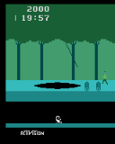
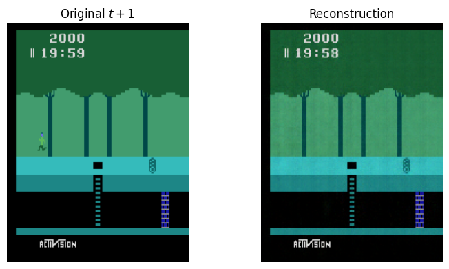
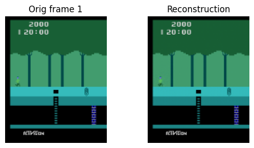

### Neural Pitfall

### What did I do?
I extended this repo's code for Atari's pitfall game. The main reason to choose this game was because It had a timer included, as was mentioned in the additional follow-up task and since it was already a Atari Game hence setting up the environment was relatively straightforward which gave me more time to focus on the architecture and general improvement of the overall pipeline. At the very end I also tried incorporating time embeddings and working on an architecture that could predict the next action given the current state (detailed this below of why I tried this). But due to time constraint I was unable to properly try this aspect. The current VQVAE architecture is working pretty good but the LatentMLPs aren't the best hence the model isn't working that good, this part still has scope of improvement.

### Major Challenges that I faced
The major challenge was in the training of the VQVAE itself. The existing architecture failed to capture the character in the reconstruction process. To fix this I simply added residual connections and changed the dimensions of the latent to 8*10 from 5*7. Apart from the changes in the VQVAE, I did similar additions to the StateActiontoLatent model.  

### On the follow up:
Without any time embeddings or any external signal of time, after a certain point the time remains same or oscillates between certain values. A proper fix would include ntroducing time embeddings as well in the current architecture. 

### Failure Example of Previous Models!

### Residuals Help in Capturing the Character

### Why did you pick the particular project?
Compared to the other projects I found this to be the most interesting and the most new one for me. I had relatively less domain knowledge for this project compared to the other projects and I also wanted to explore world models from a long time so this seemed to be the perfect starting point.

### What did you learn in the project?
I mainly learned about the basic concepts of world models and how they are build. Apart from that I was also able to revisit the concepts of video prediction and RL. 

### What surprised you the most?
One surprising thing which I observed was that the world model's performance is highly dependent on the LatentMLPs and the agent used to generate the training data for the latent model, although it was kind of intuitive once I noticed this issue. To be precise, what I observed was that if the accuracy of the latentMLPs was low then the world model stegnates and it only predicted from a fixed no. of states. Once I was able to get the accuracy a little higher the world model performed better and was not generating from a fixed set of states.

### If you had more compute/time, what would you have done?
I would have focused on making the architecture more general and much larger so that I could train it on the entire set of atari games. Also, I was trying a fun thing, that is to try to predict the next action given the current state along side next frame prediction. It had two benefits, First of all, prediction of next frame along side next action or other similar information helps in having better next state prediction generation and secondly, I have had this thought in mind, that can we train a world model that could also suggest the best next action by itself, based on it's demonstrations hence, training the model to predict the next best action could also help in this. 

### If you had to write a paper on the project, what else needs to be done?
As already mentioned I would like to extend it to create a generalized architeccture that can create any atari game and also at the same time Instead of just creating a world model, I would like to test out the concept of making the world model learn the best actions given a current state. This will have two advantages, It would help in enriching the understanding of the world model about the entire game and also It could be used to train RL Agents or in other things like rewards, etc. 

### Use of AI
I have used LLMs only for help in the coding part, but for ideation and this report I haven't used LLMs.